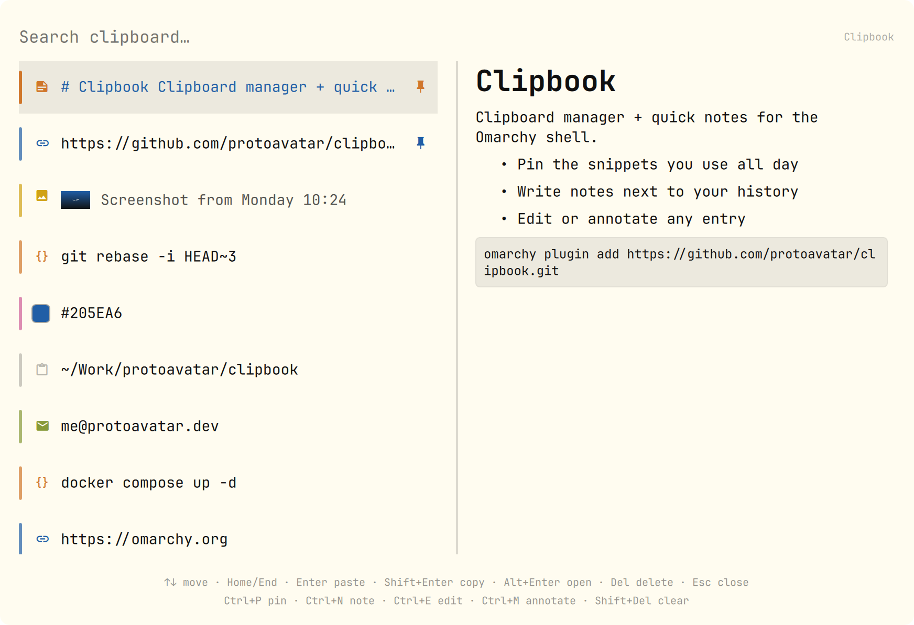

# Clipbook

A clipboard manager for the [Omarchy](https://omarchy.org) shell that also keeps
quick notes.



Clipbook replaces Omarchy's built-in `omarchy.clipboard` plugin and adds:

- **Pins** — keep the snippets you use all day from aging out.
- **Notes** — write a note on the spot; it lives side by side with your history.
- **Annotations** — attach a short note to any clipboard entry.
- **Inline editing** — fix an entry without leaving the overlay.
- **Type-aware rows** — link, colour, path, email, code, image.
- **Markdown preview** — rendered in the overlay's preview pane, with real code
  block boxes and scrolling for long content.

## Install

```bash
omarchy plugin add https://github.com/protoavatar/clipbook.git --enable
```

Clipbook declares `omarchy.clonedFrom: "omarchy.clipboard"`, so enabling it
replaces the built-in clipboard manager: the stock shortcut (`Super+Ctrl+V`) and
`omarchy menu clipboard` route to Clipbook automatically. Disabling it restores
the built-in.

## Use

Open with `Super+Ctrl+V` (or `omarchy menu clipboard`).

| Key | Action |
|-----|--------|
| type | filter (matches text and annotations) |
| `↑` `↓` | move |
| `PgUp` `PgDn` | move 6 |
| `Home` `End` | first / last |
| `Enter` | paste |
| `Shift+Enter` | copy only |
| `Alt+Enter` | open: link → browser, image → image editor, text → external editor |
| `Ctrl+P` | pin / unpin |
| `Ctrl+N` | new note |
| `Ctrl+E` / `F2` | edit inline |
| `Ctrl+M` | annotate |
| `Ctrl+L` | type an image's file path into the focused window (useful when handing an image to a coding agent or a tool that cannot accept images directly) |
| `Del` | delete entry |
| `Shift+Del` | clear history |
| `Esc` | close |

In the inline editor: `Enter` saves, `Shift+Enter` (or `Ctrl+Enter`) inserts a
newline, `Ctrl+V` pastes the live clipboard, `Esc` cancels.

## Configuration

Clipbook reads its settings from its entry in `~/.config/omarchy/shell.json`
(edits hot-reload):

```json
{
  "version": 1,
  "plugins": [
    {
      "id": "protoavatar.clipbook",
      "historyLimit": 500,
      "externalEditor": "omawrite",
      "markdownPreview": true,
      "showCategoryColors": true
    }
  ]
}
```

| Key | Default | Meaning |
|-----|---------|---------|
| `historyLimit` | `500` | max unpinned entries kept (pins and notes never age out) |
| `externalEditor` | `"omawrite"` | editor opened by `Alt+Enter` on text/notes; empty uses the system default |
| `markdownPreview` | `true` | render Markdown for notes in the preview pane |
| `showCategoryColors` | `true` | colour rows by content type |

## Data

Clipbook shares Omarchy's clipboard history at
`~/.local/state/omarchy/clipboard-history.json` and stores images under
`~/.local/state/omarchy/clipboard-images/`. A sidecar
`clipboard-history.json.bak` keeps the previous state and is used to recover
from a corrupt main file.

Capture uses Clipbook's own bounded `capture.sh`, which skips entries flagged by
password managers.

## Remove

```bash
omarchy plugin disable protoavatar.clipbook   # restore the built-in
omarchy plugin remove protoavatar.clipbook
```

## Requirements

- **Omarchy Quattro** (the `omarchy-shell` / Quickshell era).
- `wl-copy` / `wl-paste` — part of the default Omarchy set; used for capture and
  paste.
- `wtype` — types text into the focused window; used by `Ctrl+L` to hand an image
  path to an agent. Ships with Omarchy.
- `bash` — the plugin runs small shell helpers (`mkdir`, `cmp`, `cat`) for image
  editing.
- `tensaku` (`tensaku-edit`) — image editor, used by `Alt+Enter` on an image.
  Ships with Omarchy.
- `omawrite` — default external editor for `Alt+Enter` on text/notes. Ships with
  Omarchy Quattro. Configurable via `externalEditor`.
- `uwsm` (`uwsm-app`) — used to launch GUI editors detached. Part of Omarchy.

Clipbook runs inside the long-lived `omarchy-shell` process as unsandboxed code,
like every shell plugin.

## Security & Privacy

Clipbook keeps everything on your machine, like the built-in manager:

- **No network, no telemetry, no accounts.** It never makes a request on its
  own. The only thing that can reach the network is you opening a link entry
  explicitly with `Alt+Enter`/click.
- **Same storage as the built-in.** History lives in
  `~/.local/state/omarchy/clipboard-history.json` and images in
  `~/.local/state/omarchy/clipboard-images/`. Nothing leaves those files.
- **Password managers are already filtered.** Capture runs Clipbook's bounded
  `capture.sh`, which skips entries marked `x-kde-passwordManagerHint` or copied
  while `CLIPBOARD_STATE=sensitive`.
- **Remote images in notes are stripped** before rendering, so Qt's rich-text
  engine never fetches anything.
- **No privileged operations.** No installer, no privilege escalation, no remote
  build. It only spawns local tools: `wl-paste`/`wl-copy`, `tensaku` for image
  editing, and the external editor you configure.
- **Recoverable.** A `clipboard-history.json.bak` sidecar holds the previous
  state and is used to recover from a corrupt main file.

Like every Omarchy shell plugin, Clipbook runs unsandboxed inside
`omarchy-shell`. Review the source before enabling it.

## License

MIT
